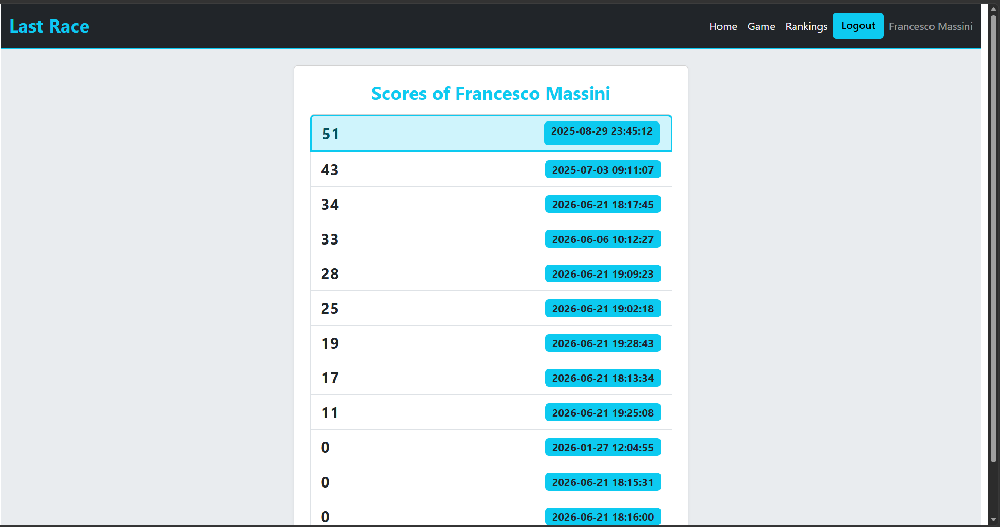
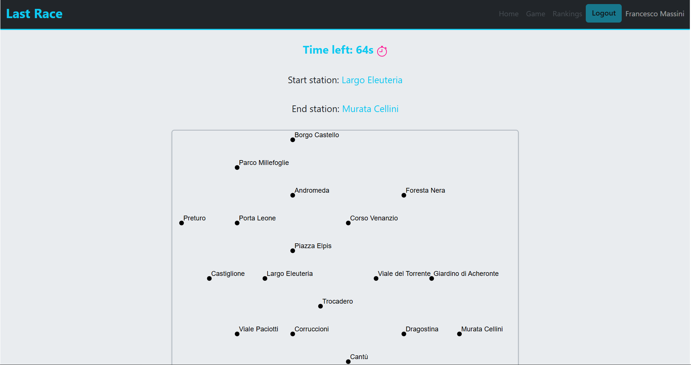
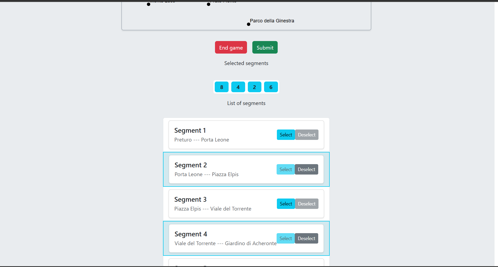

# Exam #1: "Last Race"
## Student: s362842 LISI DIANA 

## React Client Application Routes

- Route `/`: home page containing the game rules, visible to both authenticated and unathenticated users.
- Route `/login`: page showing the login form.
- Route `/logout`: page performing logout and showing a success/failure message.
- Route `/game/start`: page showing the network map and play button.
- Route `/game/planning`: page were the planning phase of the game takes place.
- Route `/game/execute`: page were the selected route and unexpected effects are shown in case of valid submitted route.
- Route `/game/result`: page showing the game match result.
- Route `/rankings`: page displaying the ordered list of scores for the currently authenticated user.

## API Server
- POST `/api/sessions`
  - Request body content: username and password
  - Response body content: authenticated user
- DELETE `/api/sessions/current`
  - No request parameters and no request body content
  - No response body
- GET `/api/lines`
  - No request parameters and no request body content
  - Response body content: list of lines
- GET `/api/stations`
  - No request parameters and no request body content
  - Response body content: list of stations
- GET `/api/segments`
  - No request parameters and no request body content
  - Response body content: list of segments
- GET `/api/events`
  - No request parameters and no request body content
  - Response body content: list of events
- POST `/api/score/me`
  - Request body content: score
  - Response body content: id of the newly created score
- GET `/api/scores/me`
  - No request parameters and no request body content
  - Response body content: list of scores for the authenticated user

## Database Tables

- Table `Users` - contains 3 registered users:
  1) Vittoria Corbello, age 34, vittoriacorbello@example.com
  2) Francesco Massini, age 23, francescomassini@example.com
  3) Giuseppe Passiflora, age 54, giuseppepassiflora@example.com
- Table `Scores` - contains a list of scores of previews matches for the 3 registered users
- Table `Lines` - contains 5 underground lines:
  - Linea Rubino
  - Linea Zaffiro
  - Linea Smeraldo
  - Linea Eliodoro
  - Linea Ametista
- Table `Stations` - contains 21 stations
- Table `Segments` - contains 22 segments, with its endpoint stations and the line they belong to
- Table `Events` - contains 9 different events, with gains going from -4 to +4, their titles and descriptions

## Main React Components

- `Layout` (in `Layouts.jsx`): component enveloping all the other routes.
- `GameLayout` (in `Layouts.jsx`): component enveloping the four game routes; handles error handling for stations, segments and lines contexts.
- `Header` (in `Layouts.jsx`): header of all the pages; divides the buttons and links shown based on whether the user is authenticated (Home, Game, Rankings, Logout) or not (Home, Login).
- `HomeView` (in `Layouts.jsx`): component showing the homepage with game rules.
- `StartView` (in `StartView.jsx`): first game component; shows the network map and the play button (navigates to PlanningView).
- `PlanningView` (in `PlanningView.jsx`): second game component; shows the netwrork map with the stations, the timer, the start and end stations. The route can be submitted by pressing the Submit button or waiting for timer expiration. From here we can navigate to:
  - ExecutionView: if the submitted route is valid.
  - ResultView: if the submitted route is invalid.
  - StartView: by pressing the End Game button. This is needed because here and in ExecutionView the header links are buttons are disabled.
- `SegmentsList` (in `PlanningView.jsx`): child of PlanningView; defines the structure of the list of segments to be selected to build the route.
- `ExecutionView` (in `ExecutionView.jsx`): third game component; shows the network map progressively the segments of the selected route and the score, updating at each unexpected event. From here we can navigate to:
  - ResultView: if we wait for the whole route to appear.
  - StartView: by pressing the End Game button. The game will be considered as not played.
- `EventView` (in `ExecutionView.jsx`): child component of ExecutionView; defines the structure of the unexpected events that appear for each segment.
- `ResultView` (in `ResultView.jsx`): fourth and final game component; shows the result of the match.
- `RankingsView` (in `RankingsView.jsx`): component showing the list of scores for the authenticated user.
- `StationsView` (in `MapComponents.jsx`): component drawing stations points and names for the network map.
- `SegmentsView` (in `MapComponents.jsx`): component drawing segments for the network map.
- `LinesView` (in `MapComponents.jsx`): component representing the legend of the network lines.
- `LoginForm` (in `LoginOut.jsx`): component showing the login form.
- `Logout` (in `LoginOut.jsx`): component performing logout and showing the logout success/error message.

The following two files have been used for testing purposes:
- `TryEvents` was added only to test the layout of all the events separately; it has no purpose in the game.
- `test.http` was used to test the behaviour of the server API.

(only _main_ components, minor ones may be skipped)

## Screenshot

## Users Credentials

1) Victo10, Vittoria123!
2) Franci11, Francesco123!
3) Beppe12, Giuseppe123!

## Use of AI Tools
AI tools have been used, Copilot and Gemini, mainly to ask for clarifications and for debugging purposes.  
Code generation was sometimes used to have examples as reference for my own code.  
Their answers were compared with the provided slides, code of lecture exercises, online sources like React, React Bootstrap, JavaScript MDN and GeeksForGeeks web pages.  
AI was also used for page styling purposes, specifically to insert the appropriate props and attributes for the components. The suggestions have been then adapted to my liking.
